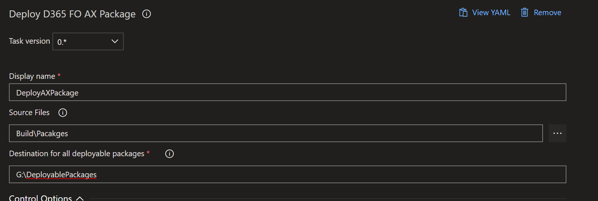

Generates a site using Hugo, a Fast and Flexible Website Generator.
Deploy D365 F&O Deployable packages

# Usage

The Release task will use the executable from the generated package from the build

You can specify some common options.

- **Source**: relative path from build artifact
- **Destination**: Destination on each machine for deployable packages, usually G:\DeployablePackages

# Release Notes

## 1.0.11

- Initial Public release